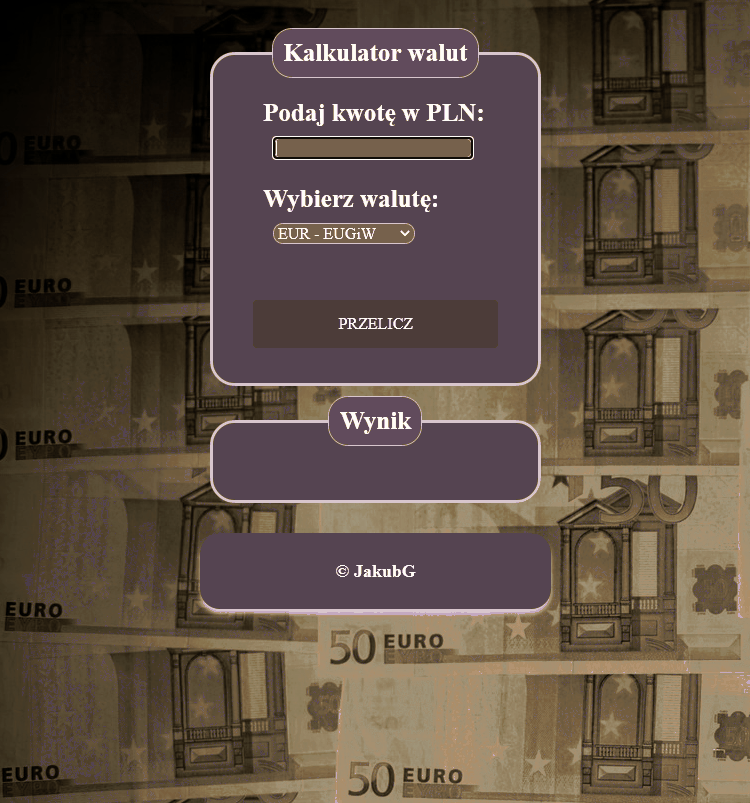

# Demo

### **[Link](https://jakubgolos.github.io/CurrencyExchange/)**

# Description

### It is a simple calculator, created for the course [YouCode](https://youcode.pl/zostawiam-email/).The arrow function is used in JavaScript, and in css methodology bem.
#### The manual is a demo.

# Used Technologies 
- **HTML & CSS**
- **JavaScript**
- **BEM methodology**
# Author 

### *Jakub Gołoś*